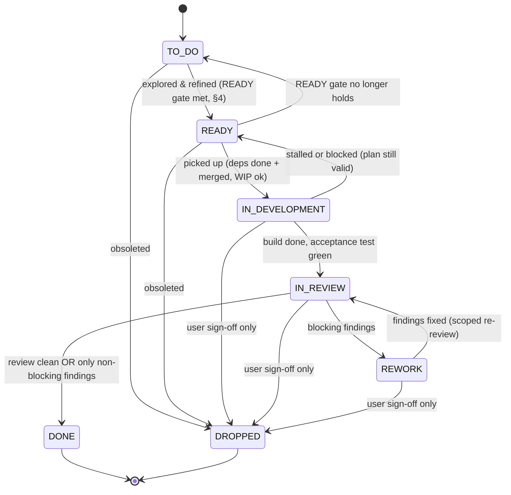

# `tickets/` — the feature flow

Every change to this project flows through **one artifact per feature: a ticket** — a markdown
file that carries a stable unique id, a status expressed by *where it lives*, an append-only
history, and a **target child-project**. A hand-maintained `BOARD.md` is the live index.

This project is an **overarching project** that may contain several **connected
child-projects** — cooperating build targets (e.g. the frontend and backend of one
application), each its own git repository, registered with `pickle project add` and recorded
in `pickle.toml`. One board and one ticket-id namespace span all of them; each ticket names its
target child in `project:` frontmatter. A project with a single child is just the degenerate
case.

## Layout

```
tickets/
├── README.md              ← short pointer to the ticket-flow skill (these rules live in the skill)
├── BOARD.md               ← the maintained index — see §6
├── 1-to-do/               ← TO DO           — captured, needs exploration/refinement
├── 2-ready/               ← READY           — refined; implementation plan complete
├── 3-in-development/      ← IN DEVELOPMENT  — being built on a feature branch
├── 4-in-review/           ← IN REVIEW       — built; awaiting the review protocol
├── 5-rework/              ← REWORK          — review found blocking findings
├── 6-done/                ← DONE            — built, reviewed, all blocking findings resolved
└── 7-dropped/             ← DROPPED         — abandoned/obsoleted (terminal, kept for the record)
```

Keep `tickets/` at a visible, top-level location in the overarching project — the board is the
most-opened surface in the repo; do not bury it in a hidden directory. The seven status
directories are **flat** — tickets are **not** split into per-child subdirectories; a ticket's
child-project is its `project:` frontmatter field, and the board (§6) groups by child. The
project's `tickets/` holds **instance data only** (the board + the tickets); this rules
document, the ticket template, and the review protocol live in the ticket-flow skill and are
referenced, not copied.

## 0. Child-projects (the multi-project model)

- **Registered children.** Each connected child-project is registered with
  `pickle project add <name> <path>` and lives as its own git repo nested under the overarching
  project. `pickle.toml` records each child's name, path, build/validate commands, branch &
  commit policy, and per-child WIP limits.
- **Every ticket targets exactly one child**, named in its `project:` frontmatter (a registered
  child name). The `feat/T-NNN-<slug>` branch for a ticket is cut **inside that child's repo**.
- **One shared board, sub-grouped by child** (§6). **One global id namespace** (§3) regardless
  of child. **WIP limits are enforced per child** (§6).

## 1. Status is the directory — one source of truth

A ticket's status **is the directory it lives in**. There is **no `status:` field in the
ticket body** — a second source of truth would drift. Status transitions are recorded only as
dated lines in the ticket's **History** section, in the form
`YYYY-MM-DD — OLD → NEW: one-clause reason` (first line: `created (TO DO). source: …`; a
human merge is recorded as `YYYY-MM-DD — merged to <base> (<MR ref>)`). Moving a ticket =
move the file + one appended History line + one `BOARD.md` edit, all in the same change (§6).

## 2. Statuses

1. **TO DO** — an idea captured; unrefined. Needs exploration to become READY.
2. **READY** — refined; the Implementation Plan satisfies the READY gate (§4). Can be picked
   up as-is.
3. **IN DEVELOPMENT** — picked up; being built on a `feat/T-NNN-<slug>` branch (in the target
   child's repo).
4. **IN REVIEW** — built, acceptance test green, handed back; awaiting review.
5. **REWORK** — review found **blocking** findings (§5); back for a scoped fix.
6. **DONE** — built, reviewed, all blocking findings resolved.
7. **DROPPED** — abandoned or obsoleted by a decision; terminal, kept with a reason.



**Backward and abort moves** (each one = file move + dated History line + board edit, always
with a reason):

- `3-in-development/ → 2-ready/` — implementation stalled or a prerequisite turned out
  broken, but the plan itself still holds. Note in History whether the `feat/` branch was
  kept or discarded.
- `2-ready/ → 1-to-do/` — the READY gate no longer holds (e.g. an impact sweep invalidated
  the plan's assumptions). The Implementation Plan is stale until re-refined.
- `→ 7-dropped/` — freely from `1-to-do/`/`2-ready/`; from `3-in-development/`,
  `4-in-review/`, or `5-rework/` **only with explicit user sign-off**. Always record the
  reason.

All other transitions are forward-only, as diagrammed.

## 3. IDs, priority, dependencies, and lineage

- **ID (one global namespace).** `T-NNN`, monotonically increasing, **never reused**,
  **shared across all child-projects**. A new ticket's number is `max(existing across all
  status dirs, including 6-done/ and 7-dropped/, regardless of child) + 1`. The id is stable
  for the ticket's life; only the slug in the filename may be tidied. The child a ticket
  belongs to is orthogonal to its id (a ticket may even be re-homed to another child without
  renumbering). **Tickets are never deleted:** `6-done/` and `7-dropped/` are permanent
  archives — pruning them would both lose the record and break the `max()+1` id rule.
- **Filename.** `T-NNN-<slug>.md`.
- **Target child-project.** `project:` frontmatter — a registered child name (§0). Required on
  every ticket; validated by `pickle board audit`.
- **Priority.** `impact` / `complexity` / `cost` frontmatter:
  - **impact** — `critical` (reshapes the product) · `high` (major capability/adoption lever) ·
    `medium` (meaningful quality/consistency win) · `low` (narrow/cosmetic).
  - **complexity** — `high` (multi-step, open design questions) · `medium` (one solid ticket) ·
    `low` (small bounded diff).
  - **cost** — `S` (< ~1 session) · `M` (~1 session) · `L` (multi-session) · `XL` (very large
    and/or recurring cost).
  While a ticket is unrefined, a grade may be an **adjacent-pair range** (`low-medium`,
  `medium-high`, `S-M`, `M-L`, `L-XL`) to encode honest uncertainty; refinement should
  collapse it to a single value. Priority order is **not** encoded in filenames — it lives in
  `BOARD.md` (§6), which lists TO DO/READY by descending impact within each child's group.
  **Assess every new ticket against the existing backlog** before filing it, and re-grade the
  board.
- **Dependencies (may cross child-projects).** Hard dependencies go in `depends-on:` frontmatter
  (a list of `T-NNN` ids, which may target any child). **Transition guard:** a ticket may not
  enter `3-in-development/` while any `depends-on` target is not in `6-done/` **with its feature
  branch merged to the base of _its own_ child-project's repo**. DONE records the review
  verdict; **merging is the human's and may lag** — a dependency is satisfied only once its code
  is actually on the base a new `feat/` branch would fork from **in the child it targets**. When
  the human reports a merge, append a dated `merged to <base>` History line to the done ticket
  and tick the board's `merged` column. Soft couplings (nice-to-know, not blocking) are
  narrative cross-references in the Description — never `depends-on`. Creating a genuine new hard
  dependency between two independent tickets requires asking the human first.
- **Lineage (`spawned-by`).** Provenance goes in `spawned-by:` frontmatter — the ticket(s) this
  one was **born from** (a review finding, a board audit, a refinement split), as a list of
  `T-NNN` ids in the same wire format as `depends-on:` (`[]` when the ticket came from a fresh
  idea or a chat). It may cross child-projects. **It is the exact opposite of `depends-on:` in
  behaviour: it gates nothing.** There is no transition guard — a ticket may enter
  `3-in-development/` no matter what state its `spawned-by` parents are in, terminal ones
  included; `pickle board audit` only checks that each id exists and that a ticket does not cite
  itself. Never fold a "created because of" relationship into `depends-on:` to make it visible:
  that would wrongly block pickup. Set at creation and left alone thereafter (like the History
  `source:` line, which it complements rather than replaces — the History line keeps the prose
  reason, `spawned-by:` makes the link queryable). `pickle ticket new --spawned-by "T-NNN"`
  fills it in.

## 4. The READY gate

"Refined" must be objective. A ticket is **READY only when its Implementation Plan** satisfies
every item below:

1. **Feature branch** named (`feat/T-NNN-<slug>`), created **inside the target child-project's
   repo** before any change. (Commit policy: local WIP commits on the branch are allowed — **the
   child-project is never pushed and no merge request is opened without explicit user
   approval**; approval unlocks finalize (squash or keep history) + push + merge request;
   **merging is the human's**. The project's `AGENTS.md` / `pickle.toml` states specifics.)
2. **Prerequisite gate** stated (or "none").
3. **Confirmed design decisions** the implementer must honour (pull any project-wide decisions
   from the project's own docs / `AGENTS.md`).
4. **Tasks** — concrete, referencing exact paths in the target child-project.
5. **Acceptance test** — runnable commands (the child-project's configured build/test/lint/docs
   commands) + expected results, re-runnable verbatim.
6. **Docs update** — which docs to add/update, or "no user-facing surface".
7. **Finish** — summary + a suggested Conventional Commit message: `<type>(<scope>): <description>`
   with the ticket id appended in brackets at the end of the subject line. `<scope>` is
   optional — per the Conventional Commits spec, omit it entirely (don't default to a
   placeholder like `all`) when the change is genuinely broad and has no single scope; it must
   never be the ticket id itself.

Until all seven hold, the ticket stays in `1-to-do/`.

## 5. The review loop — blocking vs. non-blocking findings

Trigger: **"validate ticket T-NNN"** (or **"review ticket T-NNN"** — synonyms). Runs the
skill's `resources/review-protocol.md` (plus the project's layered review addenda, if any —
overarching + the ticket's child; see the protocol's intro), which audits implementation,
quality, consistency, and docs, then classifies every finding:

- **Blocking** — breaks the golden path, ships wrong behaviour, or contradicts a locked
  decision. → ticket moves to **`5-rework/`**. Fix *only the findings* on the same branch, then
  move back to `4-in-review/` for a **scoped re-review** (verify the findings are resolved — do
  not re-audit the whole feature from scratch).
- **Non-blocking** — quality/consistency/polish that doesn't block shipping. → recorded in the
  ticket's Review section, spawned as **new TO DO ticket(s)** (each with its own `project:`
  target and `spawned-by:` naming the reviewed ticket — lineage, which never blocks the
  follow-up; see §3), and the original ticket proceeds to `6-done/`.

Findings are written into the ticket's own **Review** section — reviews produce no separate
file.

## 6. The board — a maintained index (agent rule)

`BOARD.md` is a hand-maintained index, not generated. It shows every ticket grouped by status;
within each status section tickets are **sub-grouped by child-project** under a `### <child>`
heading, with TO DO/READY ordered by impact inside each child's group. It carries a
dependencies column and the per-child WIP limits.

> **Board rule: update `BOARD.md` on every ticket move.** Any move between status directories —
> including the History append — is incomplete until the board reflects it in the same change.
> A ticket move that doesn't touch the board is a bug.

**WIP limits (per child-project):** `3-in-development/` ≤ 1, `4-in-review/` ≤ 1 (tune per
project). Stated at the top of the board, counted independently for each child (so two children
may each carry one in-development ticket). Exceeding a limit is a rule violation, not a
judgement call. `pickle board audit` counts WIP per child; `pickle board sync` repairs the
board layout from the tickets.

## 7. Ticket structure

Author every new ticket from the skill's `resources/TEMPLATE.md` (projects keep no local
copy): frontmatter (id, title, **project**, depends-on, spawned-by, grading) +
`## Description` (current spec) + `## Implementation Plan` (empty until refined; the
READY-gated executable prompt) + `## Review` (empty until reviewed) + `## History`
(append-only, dated, newest last).

## 8. How work enters the project (the only pipeline)

```
1-to-do/ → explore/refine → 2-ready/ → pick up
                                          │
                                          ▼
                        3-in-development/ (feat/T-NNN-* branch, in the target child's repo)
                                          │
                                          ▼
                           4-in-review/ → "review ticket T-NNN"
                                          │
                       ┌──────────────────┴───────────────────┐
                       ▼                                      ▼
                  5-rework/ (blocking)          6-done/ (clean / non-blocking only)
                       │
                       └──▶ back to 4-in-review/ (scoped re-review)
```

Nothing is built directly from a chat message, a review finding, or a raw idea — only from a
ticket whose Implementation Plan has met the READY gate.

**Pickup is gated by a freshness check.** Before a READY ticket enters `3-in-development/`,
its plan's assumptions are re-verified against the *current* target child-project (a ticket can
age while the tree moves under it) by a spawned, unbiased sub-agent — scoped to the ticket's own
assumptions plus the board delta since it went READY, run on every pickup. A plan found
stale is routed back to `2-ready/`/`1-to-do/` to be re-refined rather than implemented. See
the skill's *implement a ticket* procedure for the full step.
