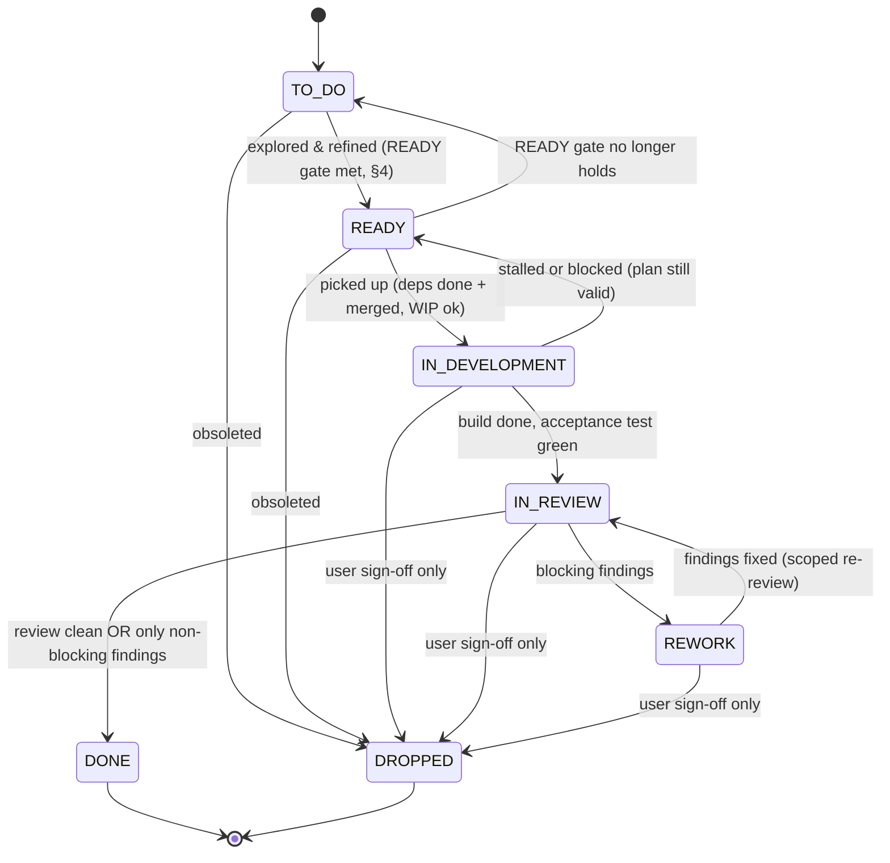

# `tickets/` — the feature flow

Every change to this project flows through **one artifact per feature: a ticket** — a markdown
file that carries a stable unique id, a status expressed by *where it lives*, an append-only
history, and a **target child-project**. A **generated** `BOARD.md` is the live index —
rendered from the ticket files, never edited by hand (§6).

This project is an **overarching project** that may contain several **connected
child-projects** — cooperating build targets (e.g. the frontend and backend of one
application), each its own git repository, registered with `pickle project add` and recorded
in `pickle.toml`. One board and one ticket-id namespace span all of them; each ticket names its
target child in `project:` frontmatter. A project with a single child is just the degenerate
case.

## Layout

```
tickets/
├── README.md              ← short pointer to the brine skill (these rules live in the skill)
├── BOARD.md               ← the generated index — never hand-edited; see §6
├── NOTES.md               ← hand-written planning notes (the board cannot carry them)
├── 1-to-do/               ← TO DO           — captured, needs exploration/refinement
├── 2-ready/               ← READY           — refined; implementation plan complete
├── 3-in-development/      ← IN DEVELOPMENT  — being built on a feature branch
├── 4-in-review/           ← IN REVIEW       — built; awaiting the review protocol
├── 5-rework/              ← REWORK          — review found blocking findings
├── 6-done/                ← DONE            — built, reviewed, all blocking findings resolved
└── 7-dropped/             ← DROPPED         — abandoned/obsoleted (terminal, kept for the record)
```

Keep `tickets/` at a visible, top-level location in the overarching project — the board is the
most-opened surface in the repo; do not bury it in a hidden directory. The seven status
directories are **flat** — tickets are **not** split into per-child subdirectories; a ticket's
child-project is its `project:` frontmatter field, and the board (§6) groups by child. The
project's `tickets/` holds **instance data only** (the tickets, the generated board, the
notes); this rules
document, the ticket template, and the review protocol live in the brine skill and are
referenced, not copied.

## 0. Child-projects (the multi-project model)

- **Registered children.** Each connected child-project is registered with
  `pickle project add <name> <path>` and lives as its own git repo nested under the overarching
  project. `pickle.toml` records each child's name, path, build/validate commands, branch &
  commit policy, and per-child WIP limits.
- **Every ticket targets exactly one child**, named in its `project:` frontmatter (a registered
  child name). The `feat/T-NNN-<slug>` branch for a ticket is cut **inside that child's repo**.
- **One shared board, sub-grouped by child** (§6). **One global id namespace** (§3) regardless
  of child. **WIP limits are enforced per child** (§6).
- **Where commits land.** The code for a ticket is committed on that child's
  `feat/T-NNN-<slug>` branch. **The bookkeeping — the ticket file, its History lines, the
  generated `BOARD.md` — is committed on the base branch of the overarching project**, never on
  a feature branch. This is not tidiness: a squash-merge of the feature branch folds every
  bookkeeping commit into the code commit, or drops it, and the board then indexes tickets whose
  recorded status disagrees with where the files are. It applies to every move a ticket makes,
  including the ones a *review* performs.
  - **Bookkeeping commits use their own `board:` form, not Conventional Commits.** A
    bookkeeping commit is a ticket's state transition, not a product change, so forcing it
    through Conventional Commits' `type(scope)` grammar either produces an uninformative scope
    (`tickets`, always) or an artificial one picked by whichever directory happened to be
    touched — either way it misdescribes what the commit actually is. Instead: `board: T-NNN[,
    T-MMM …] <verb phrase>`, where `<verb phrase>` is a short present-tense clause naming what
    happened to the ticket — for example `board: T-084 ready → in development` or `board: T-057,
    T-072 note the shared origin-base invariant`. The ticket id leads the subject — it *is* the
    subject of a bookkeeping commit, unlike a code commit where an id is a trailing
    cross-reference. Phrase a state move with an arrow (`picked up → in development`); phrase a
    content-only edit (no move) as a plain clause; list every id touched in one sitting,
    comma-separated. **Scope:** this format applies only to a commit whose staged paths are
    limited to ticket files (a `tickets/<status-dir>/*.md`) and `tickets/BOARD.md` — not merely
    "somewhere under `tickets/`", since `tickets/NOTES.md` is also under `tickets/` but is
    hand-written planning prose, not ticket/board state, and keeps ordinary Conventional
    Commits. A commit that also touches `pickle.toml` or this document is likewise not a pure
    ticket-state change and keeps ordinary Conventional Commits.
  - **Fold only when adjacent.** A content-only annotation (no board move) folds — by amending
    it (`git commit --amend`) — into an *adjacent* `board:` commit for the same ticket:
    "adjacent" means the immediately preceding bookkeeping commit for that ticket, made in the
    same sitting (no branch switch, and no distinct trigger invocation —
    pickup/review/rework/re-review — since it landed). Otherwise the annotation stays its own
    commit. Never fold across a branch switch or a distinct trigger invocation — collapsing
    those would reintroduce the exact uncommitted-bookkeeping-crosses-a-branch-switch hazard the
    pre-commit hook (below) and the origin-base check (below, and `review-protocol.md` step 9)
    exist to prevent.
  - In the **single-repo default** (`path = "."`, one child at the overarching root) the code and
    the board share one repository and one branch namespace, which is exactly what makes the
    split easy to violate by accident — nothing about `git add tickets` looks wrong on a feature
    branch. Because that history also carries the child's own commits, prefer preserving them on
    merge (rebase, or a keep-history merge) over squashing there — squashing flattens whatever
    `feat`/`fix`/`ci`/`test` structure the branch had into one commit, discarding exactly the
    granularity the `board:` form above exists to keep clean of. A child registered at a nested
    path is unaffected: squashing there does not cost the same thing, since that child's history
    isn't sharing a log with bookkeeping. This is operator guidance — no `pickle.toml` key reads
    or enforces it; see §4 item 7 and the ticket template's Finish step for the resulting
    tidy-up-before-approval obligation.
  - `pickle hooks install` enforces it locally: a `pre-commit` hook that refuses staged
    `tickets/` paths while HEAD is a feature branch. Hooks live in `.git/` and are never cloned,
    so it is once per clone. `git commit --no-verify` bypasses it for the rare commit whose
    *product* is a file under `tickets/`.
  - **The hook runs only at commit time, so it cannot catch the same failure at publish time.**
    Bookkeeping committed correctly on the base branch can still leak into a feature branch's MR
    if the remote base is behind your local base when you rebase onto it or open the MR. The
    invariant is that **the MR carries no `tickets/` path**. Check with `git fetch origin <base>
    && git diff --name-only origin/<base>...HEAD | grep '^tickets/'` (three-dot: the merge-base
    form forges use to compute an MR diff — `..` answers a different question and will mislead;
    the fetch matters because a stale remote-tracking ref makes the check fire on a base that is
    in fact already pushed). Any output means push `origin <base>` first — unless the branch's
    own product is a file under `tickets/`, the same exception the hook bullet above carves out,
    in which case pushing the base will not silence it and you publish deliberately. This bites
    wherever the board and the code share a repository, which is the single-repo default above.
  - The mirror-image hazard, for readers: a feature branch cut *before* the bookkeeping landed
    on the base branch shows a **stale ticket** in its worktree. Read the ticket and the board
    from the base branch (`git show <base>:tickets/…`), not from the branch under review.

> **Project configuration wins.** Branch prefix, ticket-id prefix, WIP limits and commit policy
> are all per-child (or overarching) `pickle.toml` settings; this document states the flow's
> defaults for them (`feat/`, `T`, `≤ 1`, publish-gated). The project's `AGENTS.md` marker block
> renders what is actually configured for each child, and it wins on any disagreement.

## 1. Status is the directory — one source of truth

A ticket's status **is the directory it lives in**. There is **no `status:` field in the
ticket body** — a second source of truth would drift. Status transitions are recorded only as
dated lines in the ticket's **History** section, in the form
`YYYY-MM-DD — OLD → NEW: one-clause reason` (first line: `created (TO DO). source: …`; a
human merge is recorded as `YYYY-MM-DD — merged to <base> (<MR ref>)`). Moving a ticket =
move the file + one appended History line; the board regenerates from the result (§6).
`pickle board audit` warns when a transition or merge line runs well past what
"one-clause" implies — move the analysis into the Description or `tickets/NOTES.md` instead;
`created` lines and other free-form dated notes carry no such shape and are never flagged.

## 2. Statuses

1. **TO DO** — an idea captured; unrefined. Needs exploration to become READY.
2. **READY** — refined; the Implementation Plan satisfies the READY gate (§4). Can be picked
   up as-is.
3. **IN DEVELOPMENT** — picked up; being built on a `feat/T-NNN-<slug>` branch (in the target
   child's repo).
4. **IN REVIEW** — built, acceptance test green, handed back; awaiting review.
5. **REWORK** — review found **blocking** findings (§5); back for a scoped fix.
6. **DONE** — built, reviewed, all blocking findings resolved.
7. **DROPPED** — abandoned or obsoleted by a decision; terminal, kept with a reason.



**Backward and abort moves** (each one = file move + dated History line, always with a
reason — the reason renders into the board's DROPPED/REWORK cell):

- `3-in-development/ → 2-ready/` — implementation stalled or a prerequisite turned out
  broken, but the plan itself still holds. Note in History whether the `feat/` branch was
  kept or discarded.
- `2-ready/ → 1-to-do/` — the READY gate no longer holds (e.g. an impact sweep invalidated
  the plan's assumptions). The Implementation Plan is stale until re-refined.
- `→ 7-dropped/` — freely from `1-to-do/`/`2-ready/`; from `3-in-development/`,
  `4-in-review/`, or `5-rework/` **only with explicit user sign-off**. Always record the
  reason.

All other transitions are forward-only, as diagrammed.

## 3. IDs, priority, dependencies, and lineage

- **ID (`<PREFIX>-NNN`, per-child counters).** An id is a child's **ticket_prefix** followed by
  a zero-padded number, monotonically increasing **within that prefix** and **never reused**. A
  new ticket's number is `max(existing ids sharing that prefix across all status dirs, including
  6-done/ and 7-dropped/) + 1`. `ticket_prefix` is configured per child in `pickle.toml` and
  defaults to **`T`**, so a single-child project (or any child that leaves it unset) just uses
  `T-NNN`; a multi-child workspace can give each child a distinct prefix (`RICK-137`, `SB-042`).
  Children that all leave the prefix unset share the one `T` counter — the legacy single global
  namespace. **Numbers are only unique within a prefix**, so across children an id must always be
  written in full (`RICK-137`, never "137"). `pickle board audit` checks a ticket's id prefix
  matches its `project:`'s configured prefix. The id is stable for the ticket's life; only the
  slug in the filename may be tidied. Because a child's prefix is part of its ids, **re-homing a
  ticket to a differently-prefixed child is a renumber, not a free relabel** (`pickle ticket
  renumber`). **Tickets are never deleted:** `6-done/` and `7-dropped/` are permanent archives —
  pruning them would both lose the record and break the `max()+1` rule.
- **Filename.** `<PREFIX>-NNN-<slug>.md`. The slug is derived from the title, so a **title is a single
  line of text**: `pickle ticket new` rejects an empty or multi-line title outright rather than
  rewriting it, because the title becomes the filename, the `# T-NNN — …` heading and a `BOARD.md`
  cell at once.
- **Target child-project.** `project:` frontmatter — a registered child name (§0). Required on
  every ticket; validated by `pickle board audit`.
- **Priority.** `impact` / `complexity` / `cost` frontmatter:
  - **impact** — `critical` (reshapes the product) · `high` (major capability/adoption lever) ·
    `medium` (meaningful quality/consistency win) · `low` (narrow/cosmetic).
  - **complexity** — `high` (multi-step, open design questions) · `medium` (one solid ticket) ·
    `low` (small bounded diff).
  - **cost** — `S` (< ~1 session) · `M` (~1 session) · `L` (multi-session) · `XL` (very large
    and/or recurring cost).
  While a ticket is unrefined, a grade may be an **adjacent-pair range** (`low-medium`,
  `medium-high`, `S-M`, `M-L`, `L-XL`) to encode honest uncertainty; refinement should
  collapse it to a single value. Priority order is **not** encoded in filenames — the board
  (§6) renders TO DO/READY by descending impact within each child's group, ties by id.
  **Assess every new ticket against the existing backlog** before filing it, and re-grade the
  board. When a grade changes on re-assessment, write the one-line reason into the ticket's own
  `## Outcome` or Description — not only into a `NOTES.md` triage table, which a later reader
  of the ticket alone never sees (T-083).
- **Dependencies (may cross child-projects).** Hard dependencies go in `depends-on:` frontmatter
  (a list of `T-NNN` ids, which may target any child). **Transition guard:** a ticket may not
  enter `3-in-development/` while any `depends-on` target is not in `6-done/` **with its feature
  branch merged to the base of _its own_ child-project's repo**. DONE records the review
  verdict; **merging is the human's and may lag** — a dependency is satisfied only once its code
  is actually on the base a new `feat/` branch would fork from **in the child it targets**. When
  the human reports a merge, append a dated `merged to <base>` History line to the done ticket
  (the board's `merged` cell renders from that line) and run `pickle board sync`. Soft couplings (nice-to-know, not blocking) are
  narrative cross-references in the Description — never `depends-on`. Creating a genuine new hard
  dependency between two independent tickets requires asking the human first.
- **Lineage (`spawned-by`).** Provenance goes in `spawned-by:` frontmatter — the ticket(s) this
  one was **born from** (a review finding, a board audit, a refinement split), as a list of
  `T-NNN` ids in the same wire format as `depends-on:` (`[]` when the ticket came from a fresh
  idea or a chat). It may cross child-projects. **It is the exact opposite of `depends-on:` in
  behaviour: it gates nothing.** There is no transition guard — a ticket may enter
  `3-in-development/` no matter what state its `spawned-by` parents are in, terminal ones
  included; `pickle board audit` only checks that each id exists and that a ticket does not cite
  itself. `pickle ticket new` additionally checks each id's **shape** (`T-NNN`) and drops repeats,
  so a typo is reported as a malformed id rather than as a missing ticket; **existence** stays the
  audit's job, since citing a ticket that has not been filed yet is legal.
  Never fold a "created because of" relationship into `depends-on:` to make it visible:
  that would wrongly block pickup. Set at creation and left alone thereafter (like the History
  `source:` line, which it complements rather than replaces — the History line keeps the prose
  reason, `spawned-by:` makes the link queryable). `pickle ticket new --spawned-by "T-NNN"`
  fills it in.
  Because follow-up tickets are **batched by theme** (§5), one `spawned-by:` link routinely stands
  for several findings: the link records *which ticket* a follow-up was born from, and the
  parent's Review table is the itemised record of *which findings* it carries. Never split a
  follow-up per finding to make the lineage granular — that is the spawn rate §5 exists to hold
  down.
- **Families (`family`).** An optional single umbrella `T-NNN` in `family:` frontmatter groups a
  ticket under an **ordinary ticket** — no new entity, no second board, no lifecycle of its own.
  Like `spawned-by:` it is lineage and **gates nothing**; unlike it, the board reads it, so it
  carries extra shape invariants `pickle board audit` enforces (only when set): the umbrella must
  **exist**, live in the **same child-project** (the board groups per child, so a cross-child
  family could not render as one group), the ticket may not be its **own** umbrella, and families
  are **flat** — an umbrella may not itself set `family:` (no nesting). On the board's TO DO/READY
  tables a family's rows stay contiguous and the whole family sorts to where **its umbrella's
  impact** ranks (umbrella row first, then members by their own impact); loose tickets interleave
  by their own impact, so `family:` supplements impact ordering rather than replacing it — it
  earns its keep once a backlog is large enough for impact to tie widely. `pickle ticket new
  --family T-NNN` sets it (shape-checked at creation, existence left to the audit, exactly like
  `--spawned-by`); it is otherwise set by hand-editing frontmatter, like `depends-on:`.
- **Splitting at refinement.** A ticket may be split while being refined, and the parts carry
  `spawned-by:` the original. Split **only when the part is independently schedulable** — it
  could be picked up, built and reviewed on its own, and someone would choose to. Otherwise it
  stays a task inside the plan: a plan with six tasks is one ticket, not six. The same promotion
  test as §5 applies, for the same reason.

## 4. The READY gate

"Refined" must be objective. A ticket is **READY only when its Implementation Plan** satisfies
every item below:

1. **Feature branch** named per the child's configured branch and ticket-id prefixes (default
   `feat/T-NNN-<slug>`), created **inside the target child-project's repo** before any change.
   (Commit policy default: local WIP commits on the branch are allowed — **the child-project is
   not pushed and no merge request is opened without explicit user approval, unless the project
   configures otherwise**; approval unlocks finalize (squash or keep history) + push + merge
   request; **merging is always the human's**. The project's `AGENTS.md` / `pickle.toml` states
   specifics.)
2. **Prerequisite gate** stated (or "none").
3. **Confirmed design decisions** the implementer must honour (pull any project-wide decisions
   from the project's own docs / `AGENTS.md`).
4. **Tasks** — concrete, referencing exact paths in the target child-project.
5. **Acceptance test** — runnable commands (the child-project's configured build/test/lint/docs
   commands) + expected results, re-runnable verbatim.
6. **Docs update** — which docs to add/update, or "no user-facing surface".
7. **Finish** — summary + a suggested Conventional Commit message: `<type>(<scope>): <description>`
   with the ticket id appended in brackets at the end of the subject line. `<scope>` is
   optional — per the Conventional Commits spec, omit it entirely (don't default to a
   placeholder like `all`) when the change is genuinely broad and has no single scope; it must
   never be the ticket id itself. For a root-path child (`path = "."`), the tidy-up happens
   before that summary is presented: interactive-rebase the branch's WIP commits into a small
   number of atomic, correctly typed/scoped commits, then default to preserving them on merge
   (rebase or keep-history, not squash — §0) rather than squashing to the single message above.

Until all seven hold, the ticket stays in `1-to-do/`.

## 5. Findings — severity, then disposition

Trigger: **"validate ticket T-NNN"** (or **"review ticket T-NNN"** — synonyms). Runs the
skill's `resources/review-protocol.md` (plus the project's layered review addenda, if any —
overarching + the ticket's child; see the protocol's intro), which audits implementation,
quality, consistency, and docs, then gives every finding a **severity** and — if it is
non-blocking — a **disposition**.

**Severity** decides whether the ticket can ship:

- **Blocking** — breaks the golden path, ships wrong behaviour, or contradicts a locked
  decision. → ticket moves to **`5-rework/`**. Fix *only the findings* on the same branch, then
  move back to `4-in-review/` for a **scoped re-review** (verify the findings are resolved — do
  not re-audit the whole feature from scratch). A blocking finding is never dispositioned: it is
  fixed, and the ticket does not proceed until it is.
- **Non-blocking** — quality/consistency/polish that doesn't block shipping. The reviewed ticket
  proceeds to `6-done/`, and each finding takes exactly one disposition below.

**Disposition** decides what happens to the finding. The four are **exhaustive** — every
non-blocking finding gets exactly one, recorded in a `disposition` column of the ticket's
Review table:

| disposition | when |
|---|---|
| **fixed inline** | prose or idiom **this branch authored, or made false** — and no behaviour change. Recorded in the table like any other finding; never a silent edit. |
| **folded** | an existing ticket already owns the ground. Add an item to it — or cite the item already there — and reference its id here. |
| **new ticket** | it would **actually be scheduled**. Batched by theme (below), each with its own `project:` target and `spawned-by:` naming the reviewed ticket — lineage, which never blocks the follow-up; see §3. |
| **noted** | none of the above. Recorded here with its evidence and closed. **This is the default.** |

Five rules make that table decide cases instead of merely listing options:

- **One finding, one disposition.** If a finding has separable parts that deserve different
  dispositions — a wrong comment *and* the substantive defect it hid, say — split it into two
  rows first. A row carrying two dispositions was never actually classified.
- **The inline bar is about causation, not authorship.** "Made false" covers a statement
  elsewhere in the tree that *this* change falsified — a plan that still lists the shipped
  feature as pending, a doc comment the new command invalidated. It does **not** cover a defect
  that was already there: pre-existing errors are `folded` or `noted`, however tempting the
  one-line fix. Ask "did this branch break it?", not "is it small?".
- **`noted` is the default, not the leftover.** A finding earns a new ticket by passing the
  promotion test — *"would this actually be scheduled?"* — **not** by being a genuine defect.
  Competent reviewers always find genuine defects, so "is it real?" answers yes every time and
  rations nothing.
- **Batching is mandatory, not encouraged.** One new ticket per *theme*, never one per finding.
  Seven findings about the same subsystem are one ticket with seven items.
- **`noted` is not "ignored".** The finding stays in the Review table permanently, with its
  evidence. A later reviewer can promote it by citing that row — the same recoverability
  `7-dropped/` gives a ticket.

Findings are written into the ticket's own **Review** section — reviews produce no separate
file. Recording is what keeps *"a review does not re-implement the ticket"* true in substance:
`fixed inline` relaxes **where** a trivial fix may happen, never **whether** it is written down.

**These four dispositions apply at every gate that can spawn a ticket**, not only at review —
the pickup applicability gate (§8) and refinement splits (§3) use the same vocabulary, the same
promotion test, and the same default.

## 6. The board — a generated index (agent rule)

`BOARD.md` is a **generated artifact**: the ticket files and their status directories are the
single source of truth, and the board is rendered from them wholesale by `pickle ticket new`,
`pickle ticket move` and `pickle board sync`. It shows every ticket grouped by status; within
each status section tickets are **sub-grouped by child-project** under a `### <child>` heading,
with TO DO/READY ordered deterministically (impact descending, ties by id) inside each child's
group. WIP counts, the DONE `merged` cell and the DROPPED/REWORK reason cells are all derived —
from the config, the merge History line, and the last transition's `--reason` respectively.

> **Board rule: never edit `BOARD.md` by hand.** Edit the tickets — the board follows. If the
> board looks wrong or stale, run `pickle board sync`; `pickle board audit` checks it in two
> tiers — every ticket row still matching but the generated layout (WIP lines, per-child
> sections) being out of date is a *warning*, any row itself disagreeing with the tickets is an
> *error* — both point at the same fix. Hand-written planning prose (triage records, parked
> notes, cross-ticket decisions) lives in `tickets/NOTES.md`, which the tooling never touches.

**WIP limits (per child-project):** `3-in-development/` ≤ 1, `4-in-review/` ≤ 1 (tune per
project). Rendered at the top of the board from `pickle.toml`, counted independently for each
child (so two children may each carry one in-development ticket). Exceeding a limit is a rule
violation, not a judgement call. `pickle board audit` counts WIP per child.

## 7. Ticket structure

Author every new ticket from the skill's `resources/TEMPLATE.md` (projects keep no local
copy): frontmatter (id, title, **project**, depends-on, spawned-by, grading) +
`## Outcome` (1–3 sentences, in user-observable terms: what changes when this ships —
descriptive, not evaluative; it states no worth claim and gates nothing) + `## Description`
(current spec) + `## Implementation Plan` (empty until refined; the READY-gated executable
prompt) + `## Review` (empty until reviewed) + `## History` (append-only, dated, newest last).
`pickle board audit` warns — never errors, never gates a move — when a non-terminal ticket's
`## Outcome` is absent, empty, or still the template placeholder (T-083); `6-done/` and
`7-dropped/` are permanent archives and are never checked.

## 8. How work enters the project (the only pipeline)

```
1-to-do/ → explore/refine → 2-ready/ → pick up
                                          │
                                          ▼
                        3-in-development/ (feat/T-NNN-* branch, in the target child's repo)
                                          │
                                          ▼
                           4-in-review/ → "review ticket T-NNN"
                                          │
                       ┌──────────────────┴───────────────────┐
                       ▼                                      ▼
                  5-rework/ (blocking)          6-done/ (clean / non-blocking only)
                       │
                       └──▶ back to 4-in-review/ (scoped re-review)
```

**No feature is built** directly from a chat message, a raw idea, or a review finding — work
enters only as a ticket whose Implementation Plan has met the READY gate. A *finding* is a
different question: it earns a **disposition** (§5), and three of the four resolve it without a
new ticket — including `fixed inline`, a bounded and recorded edit on the branch already under
review. The pipeline above governs **features**; §5 governs **findings**.

**Pickup is gated by an applicability check — testing merit, not only freshness.** Before a
READY ticket enters `3-in-development/`, its plan's assumptions are re-verified against the
*current* target child-project by a spawned, unbiased sub-agent — scoped to the ticket's own
assumptions plus the board delta since it went READY, run on every pickup. The scope is not
only assumptions that **aged**; it equally covers ones that were **wrong at filing** and went
unnoticed. A plan found stale, or no
longer worth building, is routed back to `2-ready/`/`1-to-do/` to be re-refined — or, when an
assumption no longer holds and re-refining would not save it, **dropped**: `7-dropped/` is
already a legal target from `2-ready/` (with a reason), and DROP is as legitimate a verdict here
as proceed or route-back.
The gate's own findings take **the four dispositions of §5**, with the same default: an
amendment to the plan under pickup is `fixed inline` (edit the plan, record it in History) or
`folded`; genuinely adjacent work is `noted` unless it passes the promotion test. A gate that
files a ticket per observation converts every pickup into backlog growth. See the skill's
*implement a ticket* procedure for the full step.
